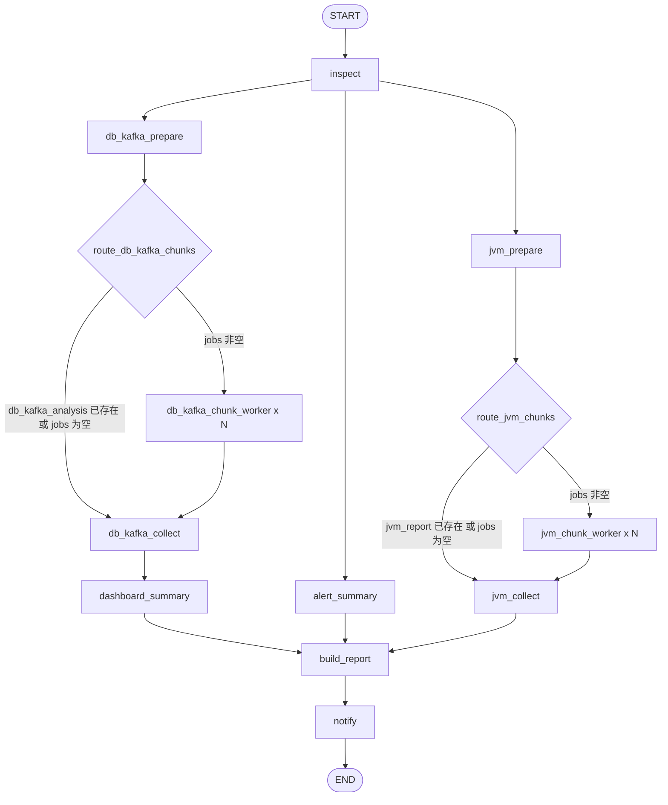
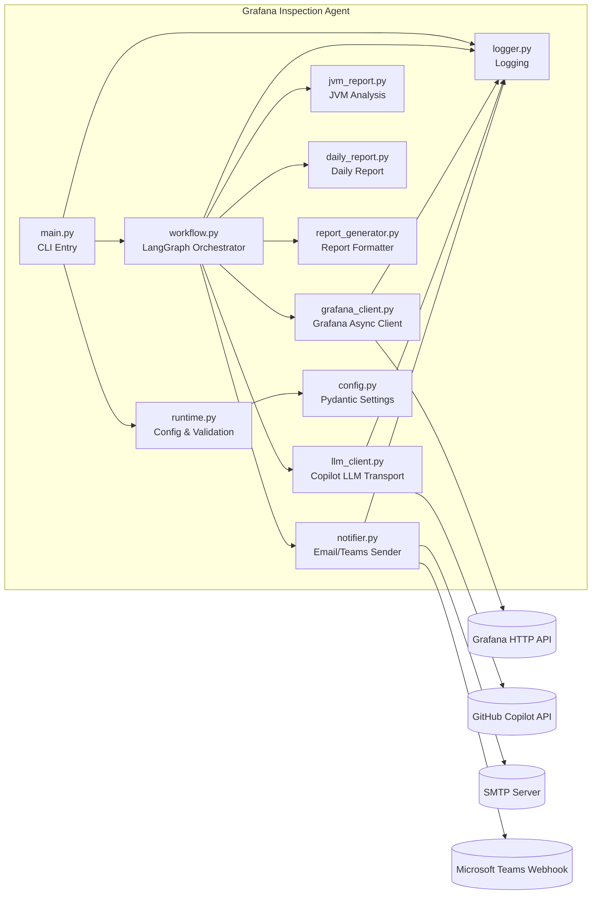
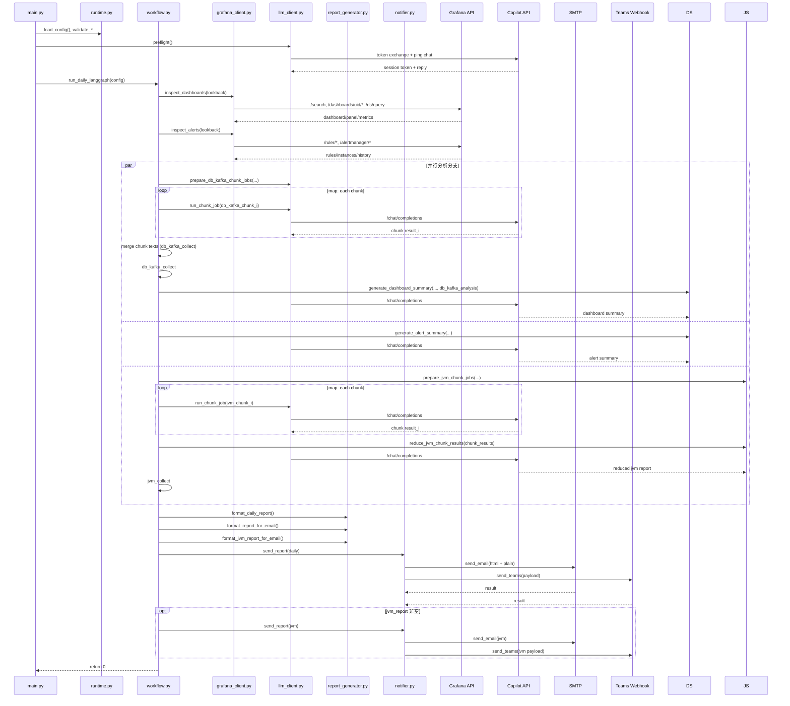
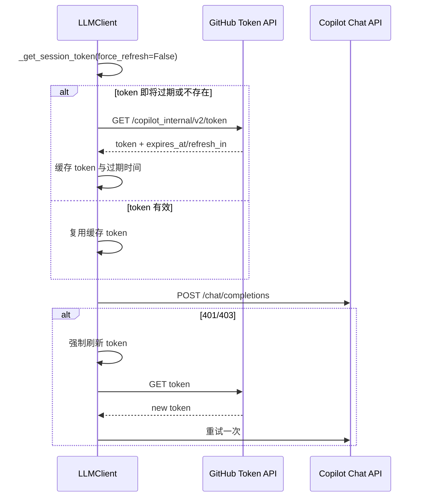

# Grafana Inspection Agent 架构文档

## 1. 文档目标

本文档是独立于 README 的架构说明，聚焦系统的：

- 运行时组件划分
- 主流程编排（LangGraph）
- 关键调用时序
- 可靠性与扩展点

适用代码版本：当前仓库 `main` 工作区（2026-04-14）。

---

## 2. 系统概览

该系统是一个基于 LangGraph 的异步巡检代理，核心目标是对 Grafana 的 Dashboard 与 Alert 数据进行自动化采集、分析、报告生成与多渠道通知。

核心能力：

- 采集：并发采集 Dashboard/Panel 指标与 Alert 信息
- 分析：调用 GitHub Copilot 会话式接口生成巡检总结
- 报告：生成日报与 JVM 专项报告（含 Email HTML/Teams payload）
- 发送：通过 SMTP 与 Teams Webhook 分发

---

## 3. 代码模块映射

| 模块 | 主要职责 | 关键对象/函数 |
|---|---|---|
| `main.py` | 启动入口、预检查、驱动工作流 | `main()`, `_preflight_llm()` |
| `runtime.py` | 配置加载、路径解析、基础校验、日志初始化 | `load_config()`, `validate_*()` |
| `workflow.py` | 定义 LangGraph 状态图与节点逻辑 | `LangGraphDailyInspection`, `run_daily_langgraph()` |
| `grafana_client.py` | Grafana API 访问、面板指标查询、告警聚合 | `inspect_dashboards()`, `inspect_alerts()` |
| `llm_client.py` | Copilot token 交换、聊天补全、chunk 执行（传输层） | `preflight()`, `_chat_completion()`, `run_chunk_job()` |
| `jvm_report.py` | JVM 专项领域分析（分片规划、重启原因约束、reduce 聚合） | `prepare_jvm_chunk_jobs()`, `reduce_jvm_chunk_results()` |
| `daily_report.py` | 日报领域分析（Dashboard/Alert 总结与日报生成） | `generate_dashboard_summary()`, `generate_alert_summary()` |
| `report_generator.py` | 报告格式化（文本/HTML/Teams） | `format_daily_report()`, `format_report_for_email()` |
| `notifier.py` | 发送邮件与 Teams 通知 | `send_report()`, `send_email()`, `send_teams()` |
| `config.py` | 配置模型定义、YAML + 环境变量覆盖 | `AppConfig`, `_ENV_OVERRIDES` |
| `logger.py` | 统一日志初始化与获取 | `setup_logger()`, `get_logger()` |

---

## 4. StateGraph 状态图（与 workflow.py 对齐）

说明：

- DB/Kafka 与 JVM 两条分支都在图内执行 `prepare -> route -> worker -> collect`。
- DB/Kafka 分支在 `db_kafka_collect` 节点执行确定性文本归并，不额外触发 LLM reduce 请求。
- JVM 分支在 `jvm_collect` 节点执行 LLM reduce 聚合（去重、冲突消解、统一评级与建议）。
- `dashboard_summary` 依赖 `db_kafka_collect`，`alert_summary` 与 JVM 分支独立并行。
- `build_report` 通过多前置节点汇合（`dashboard_summary` + `alert_summary` + `jvm_collect`）触发，避免任一分支先完成时的提前执行。
- `notify` 同时支持日报与 JVM 报告的二次发送。

---

## 5. 组件图（Component Diagram）

边界划分：

- 编排层：`workflow.py`
- 领域适配层：`grafana_client.py`, `llm_client.py`, `notifier.py`
- 表达层：`report_generator.py`
- 基础设施层：`config.py`, `runtime.py`, `logger.py`

---

## 6. 核心时序图（Sequence Diagram）

### 6.1 日常巡检主链路

### 6.2 Copilot Token 刷新时序

---

## 7. 状态模型与数据流

`InspectionState`（`workflow.py`）在节点间传递，关键字段如下：

- 输入字段：`lookback_hours`
- 采集结果：`dashboard_inspection`, `alert_inspection`
- chunk map/reduce 字段：
  - DB/Kafka：`db_kafka_chunk_jobs`, `db_kafka_chunk_job`, `db_kafka_chunk_results`, `db_kafka_analysis`
  - JVM：`jvm_chunk_jobs`, `jvm_chunk_job`, `jvm_chunk_results`, `jvm_report`
- LLM结果：`dashboard_summary`, `alert_summary`
- 报告结果：`daily_report`, `email_subject`, `email_html`, `jvm_email_subject`, `jvm_email_html`
- 发送结果：`notify_results`

数据流可抽象为：

$$
S_{0}(lookback) \xrightarrow{inspect} S_{1}(dashboard, alert)
\xrightarrow{map/reduce_{db,kafka}} S_{2}(db\_kafka\_analysis)
\xrightarrow{dashboard\_summary \parallel alert\_summary \parallel map/reduce_{jvm}} S_{3}(summary, jvm)
\xrightarrow{build\_report} S_{4}(report, email)
\xrightarrow{notify} S_{5}(delivery\_result)
$$

---

## 8. 并发与性能设计

- Grafana 侧并发：
  - Dashboard 明细通过 `asyncio.gather` 并发拉取
  - Panel metrics 查询使用 `Semaphore(5)` 限流，避免压垮 Grafana
- LLM 侧并发：
  - DB/Kafka 与 JVM 分析均采用 chunk 任务，由 LangGraph `Send` 动态 fan-out
  - 每个 chunk 对应一个 `*_chunk_worker` 节点执行单次 LLM 请求
  - DB/Kafka 分支在 collect 阶段仅归并子结果，随后将结果注入 `dashboard_summary` 的提示词上下文
  - JVM 分支在 fan-out 完成后追加一次 LLM reduce 请求，用于聚合 chunk 子报告
- 图编排并行：
  - `db_kafka_prepare`、`alert_summary`、`jvm_prepare` 三条分支图级并行
  - DB/Kafka 与 JVM 分支内部都是图内 map-reduce

---

## 9. 配置与启动约定

配置优先级（高到低）：

1. 环境变量 `GRAFANA_AGENT_CONFIG` / `APP_CONFIG_PATH` / `CONFIG_PATH` 指定路径
2. `config/config.yaml`
3. `config/config.example.yaml`

加载策略：

- 若 YAML 存在：`AppConfig.from_yaml()`，然后应用 `_ENV_OVERRIDES`
- 若 YAML 不存在：`AppConfig.from_env()`

这保证了“文件可读性 + 环境可覆盖”的部署弹性。

---

## 10. 容错与可观测性

- 启动前置校验：
  - Grafana URL/API Key 必填
  - Copilot Access Token 必填
  - Copilot preflight 失败则快速失败
- 网络调用容错：
  - Grafana/LLM/通知通道均在各自模块捕获异常并记录日志
  - LLM 在 401/403 场景自动刷新 token 并重试一次
- 日志：
  - 各模块通过统一 logger 记录节点执行、请求失败、发送结果

---

## 11. 扩展点

- 新分析分支：
  - 在 `workflow.py` 增加节点并接入 `build_report` 汇总
- 新通知渠道：
  - 在 `notifier.py` 增加 channel sender，并扩展 `send_report()` 返回值
- 新模型提供方：
  - 在 `llm_client.py` 抽象 provider adapter（当前仅 `github_copilot`）
- 持久记忆：
  - `config.py` 已定义 `MemoryConfig`，可在工作流中接入历史趋势总结

---

## 12. 架构小结

该项目采用“图编排 + 图内 map-reduce + 异步 I/O + 外部能力适配器”的设计：

- 用 LangGraph 清晰表达依赖与并行关系
- 用 `Send` 实现 chunk 级子代理动态调度与归并
- 用独立客户端隔离 Grafana/LLM/通知细节
- 用格式化层统一日报输出形态

整体结构清晰、可演进，适合继续向“多专项分析节点 + 多目标通知 + 长期趋势记忆”方向扩展。
